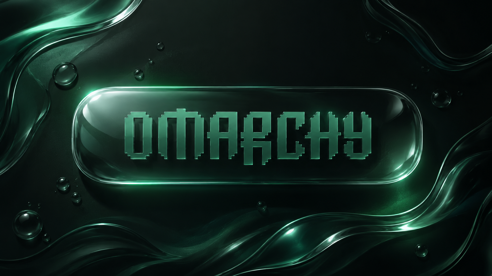

# Liquid Glass

A glass theme for [Omarchy](https://omarchy.org/).

Most Omarchy themes are a palette. This one is a *material*, and the surfaces
have no colour at all. The bar, launcher, OSD, notifications, lock field and
window borders are built from white and black at low alpha and nothing else —
so they take their colour from whatever is behind them. Over a green wallpaper
the desktop is green; over a blue one it is blue; over a photograph it is
whatever the photograph is. Nothing needs retuning per wallpaper, because
there is nothing tinted to tune.

That is what glass actually does, and it is the one thing a tinted theme
cannot fake. The rest is Hyprland's blur, a set of layer rules and per-app
background alpha, working together so every surface reads as a translucent
pane lit from the same direction.

There is no theme colour left anywhere, including the palette. The only hues
that survive are the ANSI 16, and only because `ls` needs a directory to look
different from a file and `git diff` needs an addition to look different from a
deletion. Those are readings, not decoration.



## Requirements

**Hyprland 0.53.0 or newer.** Two things set that floor, and both fail
loudly rather than degrading, so it is worth checking before installing:

| Feature | Needs | Why |
|---|---|---|
| `decoration:rounding_power = 4.5` | 0.47.0 | squircle corners — added as "supercircular window corners" ([#8943](https://github.com/hyprwm/Hyprland/pull/8943)) |
| `windowrule`/`layerrule … match:…` | 0.53.0 | the rule syntax was rewritten and the old comma form removed ([#12269](https://github.com/hyprwm/Hyprland/pull/12269)) |

0.53.0 is the binding one. On anything older every `windowrule` and
`layerrule` in `hyprland.conf` is a config error, which means no blur on the
bar, launcher, notifications or OSD, and no window transparency — the theme
would load as a palette and nothing else. Check with `hyprctl version`.

Omarchy 3.x ships well past this, so if the theme installs through
`omarchy theme install` you are already fine. Developed and verified against
Hyprland 0.56.0 / Omarchy 3.8.4.

### Verified

- **Fractional and mixed scaling.** Checked on a second output at `scale
  1.5` alongside the built-in panel at `1.0`. The bar renders correctly at
  both — 1px rim intact, radius correct, blur working, no seams or doubled
  edges. Compositor cost was unchanged within measurement noise when the
  second output was added.
- **Multi-GPU.** This machine has Intel and NVIDIA adapters; Hyprland renders
  on the Intel one. Nothing here is GPU-specific, but the theme has not been
  tested with the compositor driven from a discrete GPU.
- **Not verified: two *physical* monitors.** Only one physical display was
  available, so the second output above was a virtual one. Multi-monitor
  frame time is therefore untested, as is anything involving differing
  refresh rates. No GPU profiler was installed, so the load figure above is
  compositor CPU time, not GPU frame time.
- **Terminal legibility.** Unchanged, and measured rather than assumed:
  glyph-to-background contrast across an Alacritty window at `alpha = 0.74`
  has a median of 14.6:1, against 14.9:1 for the same colours fully opaque.
  Terminals only make the *background* translucent, so the glyphs never
  thin out. All four terminal configs are untouched by any of the above.

## Install

```bash
omarchy theme install https://github.com/Jitheswar/omarchy-liquid-glass-theme.git
```

Then set the bar height, which a theme has no way to reach — it lives in
`~/.config/waybar/config.jsonc`, not in any theme file:

```jsonc
"height": 38,   // Omarchy ships 26
```

At 26 the floating pill has only ~18px of interior once margins and borders
are taken out. It works, but it reads as a thin strip rather than a panel.
Run `omarchy restart waybar` afterwards.

Then round the lock field, which a theme cannot reach either. Change this one
line inside the `input-field { }` block of `~/.config/hypr/hyprlock.conf`:

```ini
rounding = 22   # Omarchy ships 0
```

That is `radius-lg`, the same step the OSD uses — the field is 650x100, the
same order of size. It takes effect the next time you lock; nothing to
restart.

**Known limitation:** the shipped theme alone cannot round the lock field.
Omarchy's `hyprlock.conf` `source`s the theme's file and then writes its own
`input-field { }` block, and hyprlock registers `input-field` as an
anonymous-key-based category — so a second block from a theme adds a *second*
password field rather than overriding the first. A theme is limited to
substituting the five colour variables into that shared base config. The other
two shape properties in the same position, `shadow_passes` and
`outline_thickness`, are documented with suggested values at the top of
`hyprlock.conf`.

Or clone it into place and switch manually:

```bash
git clone https://github.com/Jitheswar/omarchy-liquid-glass-theme.git ~/.config/omarchy/themes/liquid-glass
omarchy theme set "Liquid Glass"
```

## The palette

Neutral. Everything structural — background, foreground, cursor, accent,
selection and all four greys — is a grey, so nothing in this file tints the
desktop.

| Role | Colour | |
|---|---|---|
| `background` | `#0A0A0A` | near-black, no cast |
| `foreground` | `#E0E0E0` | plain off-white |
| `accent` | `#FFFFFF` | emphasis is brightness now, not hue |
| `cursor` | `#FFFFFF` | |
| `color8` | `#6E6E6E` | muted text |

The ANSI 16 keep their hues, and that is not a hedge. `color2` is what `ls`
paints a directory and what `git diff` paints an addition; `color1` is what it
paints a deletion. Greying those out would not remove theme colour, it would
remove the ability to tell one thing from another. They are spread deliberately
wide, because syntax collapses into mush if every hue sits in the same wedge —
the green and cyan simply lost the mint cast they used to carry.

## How the glass is built

The target is clear, lit glass — not frost. Those are opposite settings, and
it's worth being explicit about why, because the obvious knobs push the wrong
way. **Frost is diffusion**: many blur passes plus grain, tuned to *hide* what
sits behind. This aims at something you look *through*.

**Blur is kept low.** Size 4, three passes. At size 8 and four passes you get a
fogged panel; down here the shapes behind stay legible, which is what makes the
pane read as transparent rather than merely tinted. This is the single biggest
difference from a frosted theme.

**Grain is switched off.** `noise = 0.003`, near Hyprland's floor. Grain is
exactly what the eye reads as "frosted" — it is the texture of etched glass.
Just enough is left to stop the wallpaper's wide gradients from banding.

**The glass is lit, not veiled.** `brightness = 1.18` lifts the pane off the
wallpaper so it looks illuminated instead of smeared, and `vibrancy = 0.80`
puts back the saturation a plain gaussian washes out, so colour bleeds through
as refraction rather than grey.

**The edge does most of the work.** A 3px border with a 90° gradient — white
at the top falling to black at the base, no hue in it — reads as a bevel
catching a single overhead light. At 1px it collapses into a plain outline. In the GTK
surfaces the same idea is an `inset 0 1px 0` highlight plus a vertical
gradient body; remove that one inset shadow and the bar goes flat instantly.

**Transparency works two different ways, because apps fall into two camps.**

Terminals can render a translucent *background* while keeping glyphs fully
opaque — that's the good kind of glass, and it's why `active_opacity` stays at
`1.0` and each terminal config sets its own alpha (`0.74`) instead.

Everything else — GTK, Electron, browsers — draws an opaque background and
exposes no equivalent knob. Nothing in a theme can change that; Omarchy doesn't
apply a theme `gtk.css`, and Chromium has no transparency setting. The only
lever left is Hyprland window opacity, which fades text along with the
background. So those windows get a mild `opacity 0.92 0.90` — enough that the
blur behind registers as glass, not so much that a page becomes hard to read.
Blur still applies underneath because `blur:ignore_opacity` is on.

The inactive figure is 0.90 rather than 0.86 because that was measured rather
than guessed. Compositing known colour pairs and reading the result back off
the screen, black-on-white keeps 11.7:1 even at 0.86 — body text is never in
danger. What suffers is mid-grey secondary text on a dark UI, the thing every
Electron app labels with: nominally 5.32:1, which clears WCAG AA, and 3.86:1
at 0.86, which does not. 0.90 brings it back to 4.15:1. Full opacity only
measures 5.00:1 here, so no setting fully repairs it — this is the point where
the glass stops paying for itself, not a value to keep pushing.

Media apps are excluded: Omarchy's own rules strip the opacity tags from mpv,
vlc, OBS, Zoom and YouTube tabs, and this theme matches on those tags rather
than on window class, so video stays fully opaque for free.

**The launcher over light windows is the one place this trade-off bites, and
it is only mitigated, not solved.** Every other surface here sits over the
wallpaper, which is nearly black and known in advance. The launcher opens over
whatever you were looking at, and over a white document the page behind used
to lift the panel to near-white and take the near-white text with it. Two
things push back: a dark halo behind the glyphs, which costs nothing against
the wallpaper because it *is* the wallpaper's colour, and a launcher fill at
`0.60` rather than `0.30` — a deliberate exception to clear-not-frosted,
documented at the site in `walker.css`. Measured over a blank white window:

| | before | after |
|---|---|---|
| item labels | 2.3–3.1:1 | 4.4–5.5:1 |
| selected row label | 1.0:1 | 2.9:1 |
| search placeholder | 1.3:1 | 1.8:1 |

Body text clears roughly WCAG AA now.

The selected row took a second fix of its own. Omarchy's stylesheet paints its
label with the accent, which on a pill this theme had *also* tinted was low contrast
on every backdrop — 2.9:1 even over the wallpaper, where nothing is washing it
out. That label is now the same near-white as every other row, and the pill's
own tint and specular edge carry the "selected" signal instead, which they
were already doing anyway. Over the wallpaper it went 2.9:1 → **5.0:1**, which
clears AA outright; over a white window, 1.7:1 → 2.9:1.

The two that remain short are short by construction. The placeholder is
deliberately half-opacity, and the selected row still trails the others over
white because the pill it sits on is *lighter* than the panel — a lit
selection and a light backdrop pull in the same direction. Raising the fill
does nothing for either.

**Known limitation:** GTK-CSS cannot sample what is behind a surface, so no
part of this can adapt to the backdrop — there is no `backdrop-luminance` to
respond to and no way to fake one. What is here is a fixed cost paid against
the worst case. A launcher that genuinely adapted would need walker itself to
sample the screen behind it and swap a style class, which is an upstream
feature, not a theme one.

**Corners are squircles.** `rounding = 20` (Hyprland's ceiling) at
`rounding_power = 4.5` gives continuous curvature rather than a circular arc
pasted onto a straight edge — most of what makes a corner look moulded.

**Shell surfaces are layers, not windows**, so they need their own rules —
`layerrule = blur on` per namespace, plus `ignore_alpha` so the clear margin
around a floating panel doesn't get blurred along with the panel.

`xray` is off on purpose: seeing other windows refracted behind the front one
is the layered depth the theme is built around. Turn it on in `hyprland.conf`
to trade that for lower GPU load.

## What's in here

| File | |
|---|---|
| `colors.toml` | drives everything Omarchy generates (btop, helix, obsidian, gum, chromium, hyprlock…) |
| `hyprland.conf` | blur, squircle rounding, specular borders, shadows, layer rules |
| `waybar.css` | floating frosted bar with a lit rim |
| `walker.css` | frosted launcher |
| `swayosd.css`, `mako.ini` | frosted OSD and notifications |
| `alacritty.toml`, `ghostty.conf`, `kitty.conf`, `foot.ini` | full palette + background alpha |
| `neovim.lua` | aether.nvim fed this exact palette, transparent background |
| `hyprlock.conf` | translucent lock field over the blurred wallpaper |
| `backgrounds/` | three wallpapers |

Each of those files carries a comment explaining *why* it overrides Omarchy's
generated template — worth reading before changing one.

## Tuning

Everything in this section goes in `~/.config/hypr/looknfeel.conf`, which
Omarchy sources *after* the theme — so anything you put there wins, and an
update or a theme switch will not overwrite it.

### Profile: lite

For integrated graphics, or anything where the fans come on when you open the
launcher. Blur cost scales with passes, and `xray` is the big one: it blurs
only the wallpaper rather than resampling the windows stacked behind each
surface.

```ini
decoration:blur:passes = 2      # from 3
decoration:blur:xray   = true   # blur only the wallpaper, not windows behind
```

You lose the layered depth — windows behind the front one stop showing through
as refraction — which is the thing the theme is built around, so try `passes`
alone first and add `xray` only if that is not enough.

### Profile: reduced motion

Neither Hyprland nor GTK has a `prefers-reduced-motion` equivalent, so there
is nothing to switch on — the durations have to be overridden directly.

```ini
animations {
    # A straight line: no ease, no overshoot, no settle.
    bezier = instant, 0, 0, 1, 1

    # Speeds are in deciseconds, so 0.5 is 50ms — short enough not to read as
    # motion, long enough that surfaces do not visibly pop in and out.
    animation = layersIn,   1, 0.5, instant, fade
    animation = layersOut,  1, 0.5, instant, fade
    animation = windows,    1, 0.5, instant
    animation = windowsIn,  1, 0.5, instant
    animation = windowsOut, 1, 0.5, instant
    animation = fade,       1, 0.5, instant
    animation = workspaces, 0, 0,   instant
}
```

For no motion at all, `animations { enabled = false }` on its own is enough
and overrides everything above.

That covers the compositor. The bar and the launcher animate in GTK-CSS, which
`looknfeel.conf` cannot reach — those two transitions live in `waybar.css` and
`walker.css`, both marked with a comment about the overshoot. Delete the
`transition:` line in each, or drop the cubic-bezier for a plain `linear`, and
run `omarchy restart waybar`.

### Frost instead of clear

Want it frosted instead of clear? Push the two settings that define the
difference:

```ini
decoration:blur:size  = 8       # from 4
decoration:blur:noise = 0.02    # from 0.003 — grain is what reads as "frosted"
```

Clearer or more solid *terminals*: `opacity` in `alacritty.toml`,
`background-opacity` in `ghostty.conf`, `background_opacity` in `kitty.conf`,
`alpha` in `foot.ini`. Below about `0.65` text starts to fight the wallpaper.

Clearer or more solid *everything else* — the three `windowrule = opacity`
lines at the bottom of `hyprland.conf`. Toward `1.0` if text looks too soft,
toward `0.85` for more glass. The second number is the unfocused one and is
where the contrast goes first; see the measurements in the comment above
those lines before lowering it.

## Wallpapers

Eight of them, because the surfaces have no colour of their own any more and
the wallpaper is now the only thing deciding what the desktop looks like.

`1-omarchy-liquid-glass.png` is still the default and still the best image of
the set — it is a render, and nothing generated procedurally beats it.
`2-liquid-meniscus` and `3-liquid-submerged` are from SVG.

`4-glass-abyss`, `5-glass-amethyst`, `6-glass-ember`, `7-glass-graphite` and
`8-glass-rose` are new, generated by `backgrounds/src/generate.py`, and exist
so the theme is not tied to green. They are built to one brief: dark enough
that a translucent panel stays readable, with large smooth forms so a panel
laid on top reads as glass resting on glass rather than a sticker on a flat
field. Regenerate or add hues by editing `FAMILY` in that script.

Cycle with `omarchy theme bg next`.

## Notes

- Icons use `Yaru-prussiangreen-dark`, which ships with Omarchy.
- VS Code points at **Ocean Green: Dark** (`jovejonovski.ocean-green`), the
  closest dark theme on the marketplace; Omarchy installs it on first switch.
- Neovim needs `bjarneo/aether.nvim`, which LazyVim will fetch on next start.

## Licence

MIT. The wallpapers are included under the same terms.
