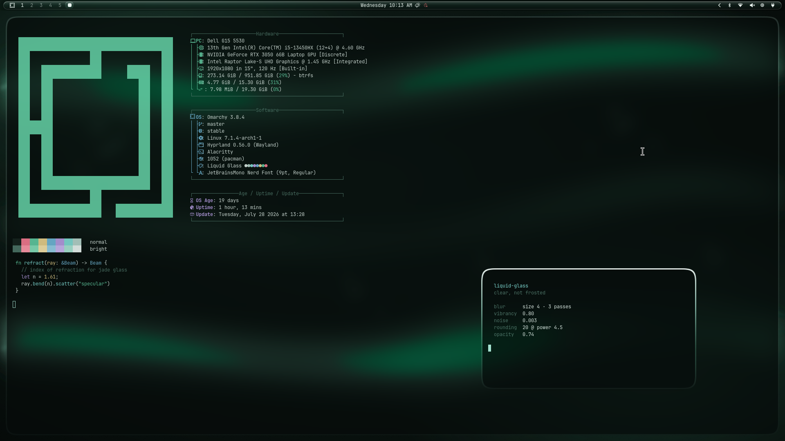

# Liquid Glass

A glass theme for [Omarchy](https://omarchy.org/).

Most Omarchy themes are a color palette. This one is a material. The bar, launcher, on-screen display, notifications, lock field and window borders are made only of white and black at low opacity, so they pick up their color from whatever is behind them. Over a green wallpaper the desktop looks green, over a blue one it looks blue. Nothing needs retuning per wallpaper, because nothing is tinted.

The only real colors left are the 16 terminal colors, because `ls` needs to show a directory differently from a file and `git diff` needs an addition to look different from a deletion.



## Requirements

**Hyprland 0.56.0 or newer.** Check with `hyprctl version`. Recent Omarchy 3.x ships it, but earlier 3.x releases don't, so the Omarchy version alone doesn't tell you.

On older versions the theme loads as a plain palette and little else. Below 0.53 there's no blur on the bar, launcher, notifications or OSD, and no window transparency. On 0.55 the inner rim and motion blur break.

| Feature | Needs |
|---|---|
| Squircle corners (`rounding_power = 4.5`) | 0.47.0 |
| `windowrule` / `layerrule ... match:` syntax | 0.53.0 |
| Inner rim (`decoration:glow`) | 0.55.0 |
| Rim and shadow with a gradient | 0.56.0 |
| `decoration:motion_blur` | 0.56.0 |

No plugins, no patched compositor, no `hyprpm`, and nothing beyond what Omarchy already installs. Developed and tested on Hyprland 0.56.0 with Omarchy 3.8.4.

What's been tested: a second monitor at scale 1.5 next to a 1.0 panel (the bar renders correctly on both), and terminal text contrast (median 14.6:1 at `alpha = 0.74`, against 14.9:1 fully opaque). What hasn't: two physical monitors (only a virtual second output was used), differing refresh rates, and running Hyprland on a discrete GPU.

## Install

```bash
omarchy theme install https://github.com/Jitheswar/omarchy-liquid-glass-theme.git && \
~/.config/omarchy/themes/liquid-glass/install
```

The second command is the only manual step. It places one `theme-set` hook, and after that everything outside the theme's own folder is applied and undone for you when you switch to or away from the theme. That includes:

- a GTK shim that makes GTK windows translucent, plus the glass folder icons
- rounding on the hyprlock password field, which a theme can't change on its own
- removing the color from fastfetch's logo and key labels, so they follow the wallpaper too
- putting all of that back when you switch to another theme

Omarchy doesn't run anything from a theme folder, so something has to place that first hook. `./install` does it once.

If you installed an earlier version and set `"height": 38` in `~/.config/waybar/config.jsonc`, put it back to `26`. That change was a mistake, it did nothing for this theme, and it left other themes with a bar that was too tall.

Or clone it and switch by hand:

```bash
git clone https://github.com/Jitheswar/omarchy-liquid-glass-theme.git ~/.config/omarchy/themes/liquid-glass
omarchy theme set "Liquid Glass"
```

### Removing it

`./uninstall` removes everything right away. Deleting the theme from **Omarchy menu, Style, Remove theme** also works, but the settings only revert when you next switch themes (the icons and optional palette service stay until you run `./uninstall`).

### Boot screen (optional)

Pick **Omarchy menu, Style, Unlock** and choose Liquid Glass. It asks for sudo, because it writes to `/usr/share/plymouth`. Or run:

```bash
omarchy plymouth set-by-theme liquid-glass
```

`omarchy plymouth reset` puts the stock boot screen back. The password box at boot is drawn by Plymouth, not by this theme, so it can't be restyled from here.

## Colors

Everything structural is gray: background `#0A0A0A`, text `#E0E0E0`, accent and cursor `#FFFFFF`, muted text `#6E6E6E`. Emphasis comes from brightness, not hue. The 16 terminal colors keep their hues and are spread wide so syntax highlighting stays readable.

### Matching the terminal colors to your wallpaper (optional)

Since the surfaces are colorless they take the wallpaper's color, but the terminal's 16 colors are fixed. This optional step shifts them toward the wallpaper's hue whenever it changes. It needs `imagemagick`, which Omarchy already has.

```bash
cd ~/.config/omarchy/themes/liquid-glass
mkdir -p ~/.local/bin ~/.config/systemd/user
ln -snf "$PWD/palette/liquid-glass-harmonize" ~/.local/bin/liquid-glass-harmonize
cp palette/liquid-glass-harmonize.{path,service} ~/.config/systemd/user/
systemctl --user daemon-reload
systemctl --user enable --now liquid-glass-harmonize.path
```

After that, `omarchy theme bg next` retunes the palette along with the wallpaper. It only writes to `~/.config/omarchy/current/theme/`, and only while this theme is active. To turn it off:

```bash
systemctl --user disable --now liquid-glass-harmonize.path
omarchy theme set "Liquid Glass"
```

## How the glass is built

The goal is clear glass, not frosted glass, and those need opposite settings. Frost hides what's behind it with lots of blur and grain. This is something you look through.

- **Low blur.** Size 4, three passes. Higher and the panel fogs over.
- **No grain.** `noise = 0.003`. Grain is what the eye reads as frosted.
- **Lit, not veiled.** `brightness = 1.18` and `vibrancy = 0.80` keep it bright and stop colors from washing out to gray.
- **The edge does the work.** A 3px border with a top-to-bottom white-to-black gradient looks like a bevel catching light from above.
- **An inner rim on windows.** Hyprland's `decoration:glow` is really an inner glow, and it makes the rim on windows.

Each file carries a comment explaining why it looks the way it does.

## What's in the repo

| File | What it is |
|---|---|
| `colors.toml` | drives what Omarchy generates (btop, helix, obsidian, gum, chromium, hyprlock and more) |
| `hyprland.conf` | blur, squircle corners, borders, shadows, layer rules |
| `waybar.css` | floating frosted bar with a lit rim |
| `walker.css` | frosted launcher |
| `swayosd.css`, `mako.ini` | on-screen display and notifications |
| `alacritty.toml`, `ghostty.conf`, `kitty.conf`, `foot.ini` | palette and background opacity |
| `neovim.lua` | aether.nvim with this palette and a transparent background |
| `hyprlock.conf` | translucent lock field over the blurred wallpaper |
| `gtk.css`, `gtk3.css` | translucent GTK4 and GTK3 windows (GTK3 only touches window chrome, so documents stay opaque) |
| `unlock.png`, `preview-unlock.png` | boot logo and its entry in the Unlock menu (`make-unlock.sh` rebuilds both) |
| `hooks/` | applies and undoes the settings a theme file can't reach, with its own tests |
| `palette/` | optional wallpaper-matched terminal colors |
| `icons/` | colorless glass folder icons |
| `backgrounds/` | six wallpapers |

## Tuning

Put these in `~/.config/hypr/looknfeel.conf`. Omarchy loads it after the theme, so your values win and updates won't overwrite them.

**Lighter on the GPU** (integrated graphics, or fans spinning when you open the launcher). Try `passes` alone first. Add `xray` only if that isn't enough, because it loses the see-through layering the theme is built around.

```ini
decoration:blur:passes = 2       # from 3
decoration:blur:xray = true      # blur only the wallpaper, not windows behind
```

**Less motion.** Hyprland has no reduced-motion setting, so override the durations. For no motion at all, `animations { enabled = false }` is enough.

```ini
animations {
  bezier = instant, 0, 0, 1, 1
  animation = layersIn, 1, 0.5, instant, fade
  animation = layersOut, 1, 0.5, instant, fade
  animation = windows, 1, 0.5, instant
  animation = windowsIn, 1, 0.5, instant
  animation = windowsOut, 1, 0.5, instant
  animation = fade, 1, 0.5, instant
  animation = workspaces, 0, 0, instant
}
```

The bar and launcher animate in their CSS. To stop that, delete the `transition:` line in `waybar.css` and `walker.css`, then run `omarchy restart waybar`.

**Launcher animation.** Omarchy turns walker's animation off. To animate it like everything else:

```ini
layerrule = no_anim off, match:namespace walker
```

**Inner rim and motion blur.** Motion blur is off by default, because dragging a window flickered on the first machine it was reported on. It may be fine on yours.

```ini
decoration:glow:enabled = false          # rim off
decoration:glow:range = 20               # from 14, wider and hazier
decoration:glow:render_power = 4         # from 2, tighter, reads as a second outline

decoration:motion_blur:enabled = false   # the smear on moving and resizing windows
decoration:motion_blur:samples = 7       # from 12, cheaper
```

There's no per-window way to turn the rim off, so a windowed video player gets a faint white edge. Fullscreen windows don't get one.

**Blur on the lock screen.** Off on purpose. With Omarchy's opaque lock wallpaper it draws a desktop nobody sees, and with a translucent lock screen it would show a blurred view of your session. If you want it anyway:

```ini
misc:session_lock_blur = true
misc:session_lock_xray = true
```

## License

MIT
